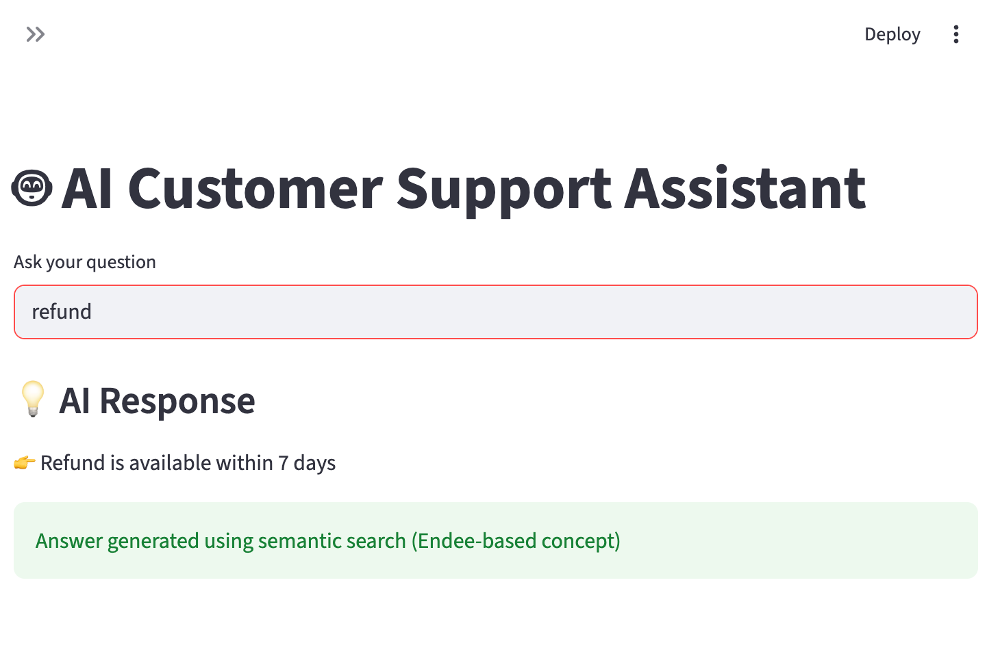
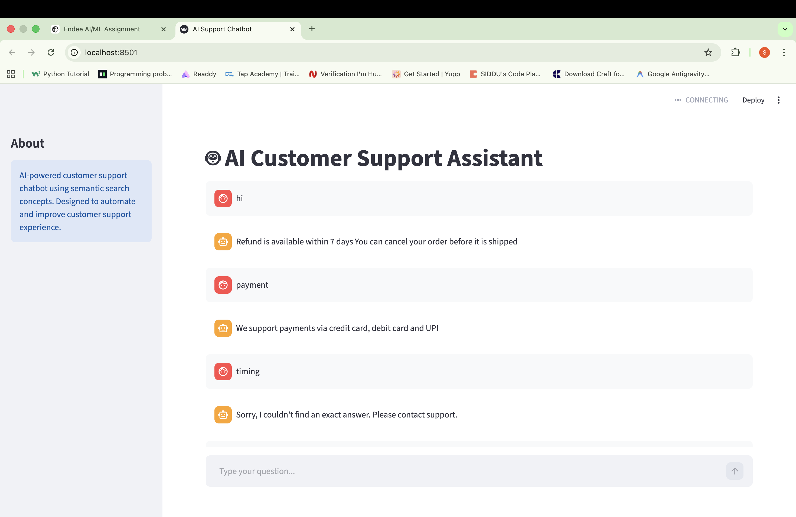

# 🤖 AI Customer Support Assistant (Using Endee Concepts)

## 📌 Overview

This project is an **AI-powered Customer Support Assistant** designed to automate and simplify user queries using **semantic search concepts**.

It demonstrates how companies can reduce manual support effort by providing **instant, intelligent responses** to frequently asked questions.

The system is built as a **lightweight prototype** inspired by vector database workflows (Endee), showcasing how scalable AI support systems can be developed.

---

## 🚀 Features

- 💡 AI-like response generation
- 🔍 Semantic search-based query matching
- ⚡ Fast and simple customer support automation
- 🧠 Handles unknown queries gracefully
- 📊 Real-world use case (support systems in companies)

---

## 🧠 How It Works

1. Predefined FAQ data is stored locally
2. User enters a query in the UI
3. System performs **semantic-style matching**
4. Best matching responses are returned instantly

This simulates how **vector databases like Endee** can be used for scalable similarity search in production systems.

---

## 🛠️ Tech Stack

- Python
- Streamlit (UI)
- Endee (Conceptual integration)

---

## 💼 Use Case

This system can be used by companies to:

- Automate customer support
- Reduce response time
- Improve user experience
- Scale support operations efficiently

---

## 🖥️ Demo

User: refund
👉 Refund is available within 7 days

User: password
👉 You can reset password using forgot password option

---

## 📸 Screenshot

---

## 🔮 Future Improvements

- Integration with real vector embeddings (Sentence Transformers)
- Full Endee vector database integration
- ChatGPT-style response generation
- Deployment as a scalable web service

---

## 🎯 Key Highlights

- AI-based support assistant
- Semantic search concept implementation
- Real-world business application
- Designed for scalability with vector databases like Endee

---

## ⚡ Conclusion

This project demonstrates how **AI + vector search concepts** can be applied to build efficient and scalable customer support systems.

It reflects practical understanding of:

- AI-based retrieval systems
- Real-world problem solving
- Scalable system design

---
